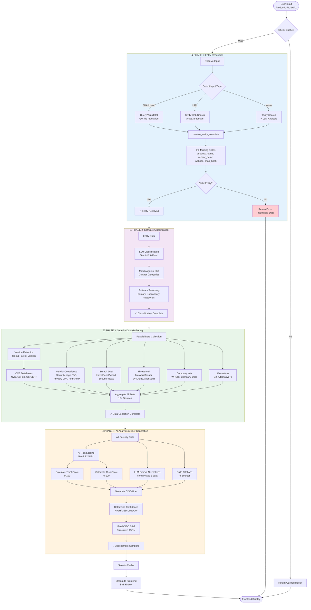
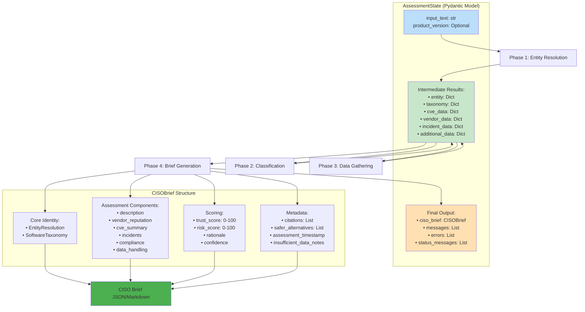

# 🔒 CISO Security Assessment Agent

**Junction 2025 Hackathon Challenge**

An AI-powered security assessment tool that turns an application name or URL into a CISO-ready trust brief with sources in minutes.

## Overview

Built with Google Gemini 2.5 Pro/Flash, this agent helps security teams and CISOs approve new tools quickly and confidently by providing:

- **Entity Resolution**: Identify vendors from minimal input (name, URL, or SHA1 hash)
- **Security Posture Analysis**: CVE trends, breach history, compliance status
- **Risk Scoring**: Transparent 0-100 trust/risk scores with rationale
- **Safer Alternatives**: Recommendations with security-focused reasoning
- **Source Citations**: All claims labeled as "vendor-stated" vs "independent"

## Quick Start

### 1. Install Dependencies

```bash
uv sync
```

### 2. Set Up Environment Variables

Copy `.env.example` to `.env` and add your API keys:

```bash
cp .env.example .env
```

Required:
- `GOOGLE_API_KEY` - Get from [Google AI Studio](https://makersuite.google.com/app/apikey)

Optional (but recommended):
- `TAVILY_API_KEY` - Get from [Tavily](https://tavily.com) for enhanced search
- `NVD_API_KEY` - Get from [NVD](https://nvd.nist.gov/developers/request-an-api-key) for higher CVE lookup rate limits

### 3. Run Security Assessment

#### Option A: CLI Usage

```bash
# Assess by product name
python ciso_cli.py assess --product "Slack"

# Assess by URL
python ciso_cli.py assess --url "https://slack.com"

# Assess by SHA1 hash
python ciso_cli.py assess --sha1 "a1b2c3d4e5f6..."

# With version filtering
python ciso_cli.py assess --product "Zoom" --version "5.14.5"

# Save as markdown report
python ciso_cli.py assess --product "Dropbox" --output markdown --output-file report.md

# Save as JSON
python ciso_cli.py assess --product "Salesforce" --output json --output-file assessment.json

# Disable cache (force fresh assessment)
python ciso_cli.py assess --product "GitHub" --no-cache
```

#### Option B: REST API with Streaming

```bash
# Start the API server
python apps.py

# Or with uvicorn for production
uvicorn apps:app --host 0.0.0.0 --port 8000 --workers 4
```

**Test the API:**
```bash
# Streaming mode (recommended) - shows real-time progress
python test_api_client.py --product "Slack"

# With version
python test_api_client.py --product "Zoom" --version "5.14.5"

# Non-streaming mode - waits for final result
python test_api_client.py --product "Dropbox" --no-stream
```

**API Endpoints:**
- `POST /assess/stream` - Streaming assessment with real-time progress (SSE)
- `POST /assess` - Non-streaming assessment (returns final result)
- `GET /health` - Health check
- Interactive docs: `http://localhost:8000/docs`

See [API_USAGE.md](API_USAGE.md) for detailed API documentation and frontend integration examples.

**Real-Time Status Updates:**

The CLI shows live progress as the assessment runs:
- 🔍 Entity resolution
- 📊 Software classification
- 🔐 Security data gathering (NVD, vendor pages, incidents)
- 🤖 AI analysis and scoring
- ✓ Success indicators with color coding

**Cache Management:**

```bash
# View cache statistics
python ciso_cli.py cache stats

# Clear cache
python ciso_cli.py cache clear
```

## Output Example

```
╔═══════════════════════════════════════════════════════════╗
║   🔒 CISO Security Assessment Tool                       ║
║   AI-powered security assessments in minutes             ║
║   Junction 2025 Hackathon                                ║
╚═══════════════════════════════════════════════════════════╝

Assessing: Slack

🔍 Resolving entity: Slack
✓ Identified: Slack (type: name)
📊 Classifying software category...
✓ Category: Communication platform
🔐 Gathering security data from multiple sources...
  → Querying NVD for CVE data...
  ✓ Found 60 CVEs (1 critical)
  → Checking vendor security pages...
  ⚠ No security page found
  → Checking incident databases...
  ⚠ Incident data limited (requires paid APIs)
🤖 Generating CISO security brief with AI...
  → Analyzing security posture...
  ✓ AI analysis complete
  → Calculating trust & risk scores...
  ✓ Trust: 65/100, Risk: 45/100
  → Identifying safer alternatives...
  ✓ Found 1 alternative(s)
  → Finalizing CISO brief...
✓ CISO brief generated successfully

✓ Assessment complete

================================================================================
SECURITY ASSESSMENT: Slack
================================================================================

VENDOR: Slack Technologies
ASSESSED: 2025-11-15 14:30:00
CONFIDENCE: MEDIUM

================================================================================
EXECUTIVE SUMMARY
================================================================================

Trust Score: 65/100
Risk Score:  45/100

Rationale: Moderate CVE history with good vendor transparency. SOC2 Type II 
certified. Some historical security incidents but strong compliance posture.

[... full assessment details ...]
```

## Features

### Real-Time Assessment Progress
- **Live status updates** during assessment
- **Step-by-step visibility** into data gathering
- **Color-coded indicators** (✓ success, ✗ error, ⚠ warning)
- **Progress tracking** through all 4 assessment stages

### High-Signal Sources (Priority Order)

**Independent Sources:**
- ✅ NVD (National Vulnerability Database) - CVE data
- ✅ CISA KEV - Known Exploited Vulnerabilities
- 🚧 CERT Advisories
- 🚧 HaveIBeenPwned - Breach data (requires API subscription)

**Vendor-Stated Sources:**
- ✅ Vendor Security/PSIRT pages
- ✅ Terms of Service & DPA
- ✅ Compliance claims (SOC2, ISO, GDPR)

### Assessment Components

1. **Entity Resolution** - Canonical product/vendor identification
2. **Software Taxonomy** - Category classification
3. **CVE Analysis** - Vulnerability trends with CISA KEV cross-reference
4. **Vendor Reputation** - Security page presence, certifications
5. **Incident History** - Breach and abuse signals
6. **Compliance Status** - SOC2, ISO, GDPR verification
7. **Data Handling** - Encryption, retention, sharing policies
8. **Trust/Risk Scores** - Transparent 0-100 scores with rationale
9. **Alternatives** - Safer product recommendations
10. **Citations** - All sources with labels (vendor-stated vs independent)

### Cache System

- **Automatic Caching**: Assessments cached for 24 hours by default
- **Reproducibility**: Same input = same cached result within TTL
- **Cache Management**: View stats and clear cache via CLI

## Architecture

### High-Level System Architecture

The backend is a **CISO Security Assessment System** built on LangGraph that evaluates software products, URLs, or file hashes for security risks. It follows a **4-phase pipeline** architecture with 25+ security tools.

```mermaid
graph TB
    subgraph "Entry Points"
        API[FastAPI REST API<br/>app.py]
        CLI[CLI Interface<br/>ciso_cli.py]
    end
    
    subgraph "Core Orchestration Layer"
        Graph[LangGraph Workflow<br/>ciso_assessor.py]
        State[Assessment State<br/>security_state.py]
        Config[Configuration<br/>configuration.py]
    end
    
    subgraph "Tool Layer - 25+ Security Tools"
        ER[Entity Resolution<br/>resolve_entity, detect_input_type]
        VUL[Vulnerability DB<br/>lookup_cves, check_cisa_kev]
        COMP[Vendor Compliance<br/>fetch_vendor_info, check_fedramp]
        THREAT[Threat Intel<br/>malwarebazaar, urlhaus, otx]
        INC[Incident Data<br/>haveibeenpwned, security news]
        ADV[Advisories<br/>US-CERT, GitHub Advisories]
        ALT[Alternatives<br/>search_alternatives]
        COMM[Community<br/>reddit, stackoverflow, github]
    end
    
    subgraph "AI Models"
        Gemini[Google Gemini 2.0/2.5<br/>Classification, Analysis, Scoring]
    end
    
    subgraph "External Data Sources"
        NVD[NVD - CVE Database]
        VT[VirusTotal]
        HIBP[HaveIBeenPwned]
        Tavily[Tavily Search API]
        MB[MalwareBazaar]
        UH[URLhaus]
        OTX[AlienVault OTX]
        FR[FedRAMP]
    end
    
    API --> Graph
    CLI --> Graph
    Graph --> State
    Graph --> Config
    Graph --> ER
    Graph --> VUL
    Graph --> COMP
    Graph --> THREAT
    Graph --> INC
    Graph --> ADV
    Graph --> ALT
    Graph --> COMM
    Graph --> Gemini
    
    ER --> VT
    ER --> Tavily
    VUL --> NVD
    COMP --> FR
    THREAT --> MB
    THREAT --> UH
    THREAT --> OTX
    INC --> HIBP
    INC --> Tavily
    
    style Graph fill:#4CAF50
    style State fill:#2196F3
    style Gemini fill:#FF9800
```



### 4-Phase Assessment Pipeline

The system processes each assessment through 4 sequential phases with conditional routing and parallel data collection:



### Tool Organization Structure

All security tools are organized by category for maintainability and discoverability:

```mermaid
graph LR
    subgraph "Tools Package (src/security_research_agent/tools/)"
        Init[__init__.py<br/>Central Import Hub]
        
        subgraph "Entity Resolution"
            ER1[resolve_entity]
            ER2[resolve_entity_complete]
            ER3[detect_input_type]
            ER4[lookup_latest_version]
        end
        
        subgraph "Vulnerability"
            V1[lookup_cves]
            V2[check_cisa_kev]
            V3[lookup_github_advisories]
        end
        
        subgraph "Vendor Compliance"
            VC1[fetch_vendor_security_info]
            VC2[fetch_terms_of_service]
            VC3[fetch_privacy_policy]
            VC4[fetch_dpa]
            VC5[check_fedramp]
        end
        
        subgraph "Threat Intel"
            TI1[lookup_malwarebazaar]
            TI2[lookup_urlhaus]
            TI3[lookup_alienvault_otx]
        end
        
        subgraph "Incidents"
            I1[lookup_security_incidents]
            I2[search_databreaches_net]
        end
        
        subgraph "Advisories"
            A1[search_us_cert_advisories]
            A2[search_cert_cc_advisories]
        end
        
        subgraph "Company Info"
            C1[lookup_whois]
            C2[search_company_info]
        end
        
        subgraph "Community"
            CO1[search_reddit_security]
            CO2[search_github_issues]
            CO3[search_stackoverflow]
        end
        
        subgraph "Alternatives"
            AL1[search_alternatives]
            AL2[search_app_store_info]
        end
        
        subgraph "News"
            N1[search_security_news]
        end
    end
    
    Init --> ER1
    Init --> V1
    Init --> VC1
    Init --> TI1
    Init --> I1
    Init --> A1
    Init --> C1
    Init --> CO1
    Init --> AL1
    Init --> N1
    
    style Init fill:#4CAF50
```



### State Management & Data Flow

The system uses Pydantic models for type-safe state management throughout the assessment pipeline:



### Directory Structure

```
src/security_research_agent/
├── configuration.py           # Agent configuration & settings
├── security_state.py          # Pydantic models for CISO brief
├── security_prompts.py        # CISO-focused prompts
├── ciso_assessor.py          # Main LangGraph orchestration
├── cache.py                  # File-based assessment cache
├── utils.py                  # Shared utilities
├── debug_logger.py           # Structured logging
└── tools/                    # Security assessment tools (25+)
    ├── __init__.py           # Central tool registry
    ├── entity_resolution.py  # Product/vendor identification
    ├── vulnerability.py      # CVE & CISA KEV lookups
    ├── vendor_compliance.py  # Security pages, ToS, certifications
    ├── threat_intel.py       # Malware & threat intelligence
    ├── incidents.py          # Breach & incident databases
    ├── advisories.py         # US-CERT & CERT/CC advisories
    ├── news.py              # Security news aggregation
    ├── company_info.py      # WHOIS & company data
    ├── community.py         # Reddit, GitHub, StackOverflow
    └── alternatives.py      # Alternative product search

app.py                        # FastAPI REST API with streaming
ciso_cli.py                   # Command-line interface
```

### Key Architecture Principles

✅ **Scalability**: Parallel tool execution in Phase 3  
✅ **Reliability**: Graceful error handling, conditional routing  
✅ **Extensibility**: Easy to add new tools via category modules  
✅ **Transparency**: Full citation tracking, source labeling  
✅ **Performance**: Caching, streaming updates, optimized LLM calls  
✅ **Type Safety**: Pydantic models throughout the pipeline

## Configuration

Key settings in `configuration.py`:
- `research_model`: Default `gemini-2.5-pro`
- `summarization_model`: Default `gemini-2.5-flash`
- `final_report_model`: Default `google_genai:gemini-2.0-flash-exp`
- `search_api`: Tavily or Google native search

## Development Status

**Phase 1 Complete**: ✅
- Gemini-only implementation
- Removed non-Gemini LLM providers
- Updated configuration defaults

**Phase 2 Complete**: ✅
- Security state models (EntityResolution, CVETrendSummary, CISOBrief)
- Security tools (entity resolution, CVE lookup, vendor scraping)
- CISO-focused prompts with citation requirements
- LangGraph orchestration workflow
- Cache implementation with timestamps
- Full-featured CLI

**Next Steps**: 🚧
- Demo examples and validation
- Enhanced incident lookup (HaveIBeenPwned integration)
- Web UI (stretch goal)

## Hackathon Judging Criteria Alignment

| Criteria | Score | Implementation |
|----------|-------|----------------|
| Entity resolution & categorization (20%) | ⭐⭐⭐⭐⭐ | SHA1/URL/name detection, taxonomy classification |
| Evidence & citation quality (24%) | ⭐⭐⭐⭐⭐ | All claims cited, labeled vendor-stated vs independent |
| Security posture synthesis (12%) | ⭐⭐⭐⭐⭐ | CVE trends, incidents, compliance, data handling |
| Trust/risk score transparency (8%) | ⭐⭐⭐⭐⭐ | 0-100 scores with detailed rationale & confidence |
| Technical execution & resilience (15%) | ⭐⭐⭐⭐ | Error handling, caching, rate limiting |
| Problem fit & clarity (15%) | ⭐⭐⭐⭐⭐ | CISO-focused output, decision-ready briefs |
| Alternatives & quick compare (6%) | ⭐⭐⭐⭐ | 1-2 alternatives with security rationale |

## License

MIT
