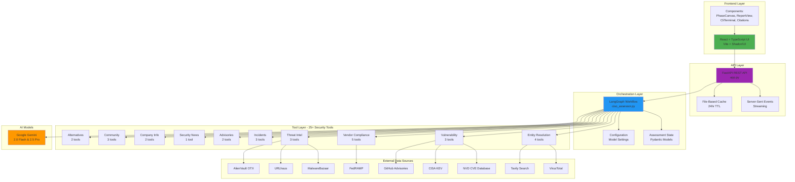
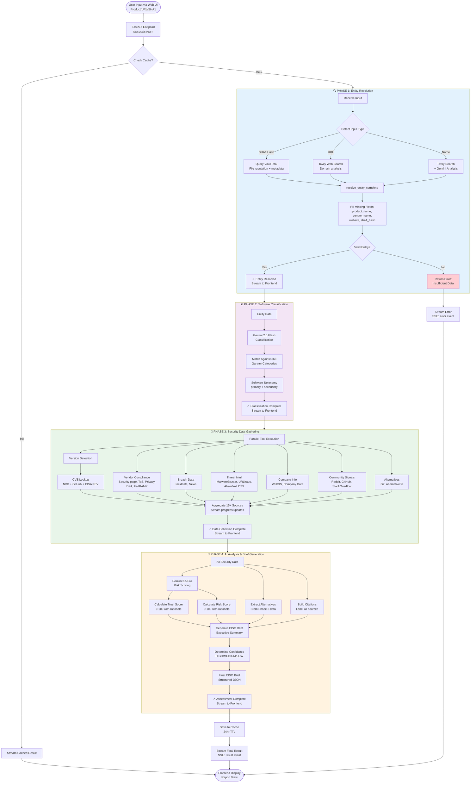
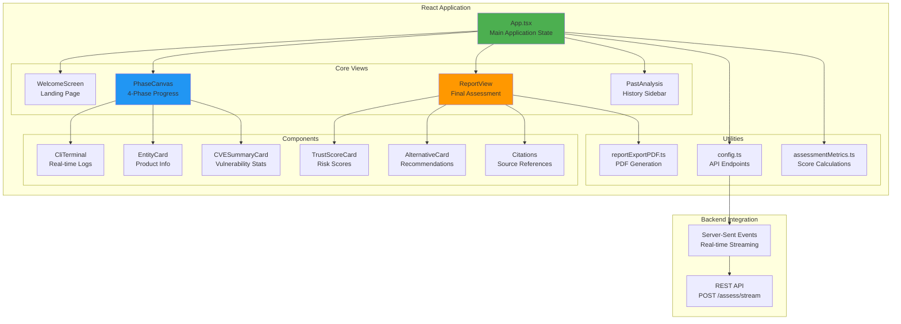

# 🔒 SecAss: CISO Security Assessor

**Junction 2025 Hackathon Challenge**


An AI-powered security assessment platform that transforms application names, URLs, or file hashes into comprehensive CISO-ready security briefs with full source citations—delivered in minutes through an intuitive web interface.

## 🎯 Overview

Built with **Google Gemini 2.0/2.5** and **LangGraph**, this full-stack application helps security teams and CISOs approve new tools quickly and confidently by providing:

- **🔍 Entity Resolution**: Identify vendors from minimal input (name, URL, or SHA1 hash)
- **📊 Security Posture Analysis**: CVE trends, breach history, compliance status from 25+ tools
- **🎯 Risk Scoring**: Transparent 0-100 trust/risk scores with detailed rationale
- **🔄 Safer Alternatives**: Security-focused recommendations with reasoning
- **📚 Source Citations**: All claims labeled as "vendor-stated" vs "independent"
- **🎨 Modern Web UI**: Real-time streaming progress with beautiful visualizations
- **💾 Smart Caching**: 24-hour assessment cache for instant results

## ✨ Key Features

### Real-Time Assessment Progress
- **Live streaming updates** via Server-Sent Events (SSE)
- **4-phase pipeline visualization** with step-by-step progress
- **Interactive terminal view** showing detailed tool execution
- **Color-coded status indicators** (✓ success, ✗ error, ⚠ warning)

### Comprehensive Security Analysis
- **25+ Security Tools** organized by category (vulnerabilities, compliance, threat intel, incidents)
- **15+ Data Sources**: NVD, CISA KEV, VirusTotal, FedRAMP, GitHub Advisories, and more
- **AI-Powered Synthesis**: Gemini 2.5 Pro analyzes and scores security posture
- **Full Citation Tracking**: Every claim backed by source with transparency labels

### Modern Frontend Experience
- **React + TypeScript** with Vite for blazing-fast performance
- **Shadcn/UI Components** for beautiful, accessible design
- **Real-time Phase Canvas** with animated progress tracking
- **Export to PDF/Markdown** for sharing with stakeholders
- **Past Analysis History** with local storage persistence

## 🚀 Quick Start

### Prerequisites

- **Python 3.10+** with `uv` package manager
- **Node.js 18+** with npm
- **Docker & Docker Compose** (optional, for containerized deployment)
- **API Keys**:
  - `GOOGLE_API_KEY` (required) - [Get from Google AI Studio](https://makersuite.google.com/app/apikey)
  - `TAVILY_API_KEY` (recommended) - [Get from Tavily](https://tavily.com)
  - `NVD_API_KEY` (optional) - [Get from NVD](https://nvd.nist.gov/developers/request-an-api-key)

### Option 1: Docker Compose (Recommended)

The fastest way to get started with both frontend and backend:

```bash
# 1. Clone the repository
git clone <repository-url>
cd WithSecure

# 2. Set up environment variables
cp .env.example .env
# Edit .env and add your API keys

# 3. Start the full stack
docker compose up --build
```

**Services will be available at:**
- 🎨 Frontend UI → http://localhost:5173
- 🔧 Backend API → http://localhost:8000
- 📚 API Docs → http://localhost:8000/docs

```bash
# Stop the stack
docker compose down
```

### Option 2: Local Development

#### Backend Setup

```bash
# 1. Install Python dependencies
uv sync

# 2. Set up environment variables
cp .env.example .env
# Edit .env and add your API keys

# 3. Start the FastAPI backend
python app.py

# Or with uvicorn for production
uvicorn app:app --host 0.0.0.0 --port 8000 --workers 4
```

Backend will be available at http://localhost:8000

#### Frontend Setup

```bash
# 1. Navigate to frontend directory
cd frontend

# 2. Install Node dependencies
npm install

# 3. Configure API endpoint (optional)
# Edit frontend/src/config.ts if backend is not on localhost:8000

# 4. Start the development server
npm run dev
```

Frontend will be available at http://localhost:5173

### Option 3: CLI Usage

For command-line assessments without the web UI:

```bash
# Assess by product name
python ciso_cli.py assess --product "Slack"

# Assess by URL
python ciso_cli.py assess --url "https://slack.com"

# Assess by SHA1 hash
python ciso_cli.py assess --sha1 "a1b2c3d4e5f6..."

# With version filtering
python ciso_cli.py assess --product "Zoom" --version "5.14.5"

# Save as markdown report
python ciso_cli.py assess --product "Dropbox" --output markdown --output-file report.md

# Save as JSON
python ciso_cli.py assess --product "Salesforce" --output json --output-file assessment.json

# Disable cache (force fresh assessment)
python ciso_cli.py assess --product "GitHub" --no-cache

# View cache statistics
python ciso_cli.py cache stats

# Clear cache
python ciso_cli.py cache clear
```

## 📸 App Quick Look


---

## 🏗️ Architecture

### System Overview

SecAss is a **full-stack security assessment platform** with a React frontend, FastAPI backend, and LangGraph-powered AI orchestration engine.



### 4-Phase Assessment Pipeline

Each assessment flows through 4 sequential phases with parallel data collection and AI synthesis:



### Frontend Architecture

The React frontend provides a modern, real-time assessment experience:



### Tool Organization

All 25+ security tools are organized into logical category modules:

```mermaid
graph LR
    subgraph "Tools Package (src/security_research_agent/tools/)"
        Init[__init__.py<br/>Central Registry]
        
        subgraph "Entity Resolution (4)"
            ER1[resolve_entity]
            ER2[resolve_entity_complete]
            ER3[detect_input_type]
            ER4[lookup_latest_version]
        end
        
        subgraph "Vulnerability (3)"
            V1[lookup_cves]
            V2[check_cisa_kev]
            V3[lookup_github_advisories]
        end
        
        subgraph "Vendor Compliance (5)"
            VC1[fetch_vendor_security_info]
            VC2[fetch_terms_of_service]
            VC3[fetch_privacy_policy]
            VC4[fetch_dpa]
            VC5[check_fedramp]
        end
        
        subgraph "Threat Intel (3)"
            TI1[lookup_malwarebazaar]
            TI2[lookup_urlhaus]
            TI3[lookup_alienvault_otx]
        end
        
        subgraph "Incidents (3)"
            I1[lookup_security_incidents]
            I2[search_databreaches_net]
            I3[search_privacy_rights]
        end
        
        subgraph "Advisories (2)"
            A1[search_us_cert]
            A2[search_cert_cc]
        end
        
        subgraph "News (1)"
            N1[search_security_news]
        end
        
        subgraph "Company Info (2)"
            C1[lookup_whois]
            C2[search_company_info]
        end
        
        subgraph "Community (3)"
            CO1[search_reddit]
            CO2[search_github_issues]
            CO3[search_stackoverflow]
        end
        
        subgraph "Alternatives (2)"
            AL1[search_alternatives]
            AL2[search_app_store_info]
        end
    end
    
    Init --> ER1
    Init --> V1
    Init --> VC1
    Init --> TI1
    Init --> I1
    Init --> A1
    Init --> N1
    Init --> C1
    Init --> CO1
    Init --> AL1
    
    style Init fill:#4CAF50
```



### Directory Structure

```
SecAss/
├── frontend/                      # React + TypeScript Frontend
│   ├── src/
│   │   ├── App.tsx               # Main application component
│   │   ├── config.ts             # API configuration
│   │   ├── components/           # React components
│   │   │   ├── PhaseCanvas.tsx   # 4-phase progress visualization
│   │   │   ├── ReportView.tsx    # Final assessment display
│   │   │   ├── CliTerminal.tsx   # Real-time log viewer
│   │   │   ├── Citations.tsx     # Source citations
│   │   │   ├── EntityCard.tsx    # Product entity card
│   │   │   ├── TrustScoreCard.tsx # Risk scoring display
│   │   │   ├── AlternativeCard.tsx # Alternative products
│   │   │   └── ui/               # Shadcn/UI components
│   │   ├── types/
│   │   │   └── api.ts            # TypeScript API types
│   │   └── utils/
│   │       ├── assessmentMetrics.ts  # Score calculations
│   │       └── reportExportPDF.ts    # PDF export
│   ├── package.json
│   └── vite.config.ts
│
├── src/security_research_agent/   # Backend Python Package
│   ├── configuration.py           # Agent configuration
│   ├── security_state.py          # Pydantic state models
│   ├── security_prompts.py        # AI prompts
│   ├── ciso_assessor.py          # LangGraph orchestration
│   ├── cache.py                  # Assessment caching
│   ├── utils.py                  # Shared utilities
│   ├── debug_logger.py           # Structured logging
│   └── tools/                    # Security assessment tools
│       ├── __init__.py           # Tool registry
│       ├── entity_resolution.py  # Product identification
│       ├── vulnerability.py      # CVE & CISA KEV
│       ├── vendor_compliance.py  # Security pages, certs
│       ├── threat_intel.py       # Malware databases
│       ├── incidents.py          # Breach databases
│       ├── advisories.py         # US-CERT, CERT/CC
│       ├── news.py              # Security news
│       ├── company_info.py      # WHOIS, company data
│       ├── community.py         # Reddit, GitHub, SO
│       └── alternatives.py      # Alternative products
│
├── app.py                        # FastAPI REST API
├── ciso_cli.py                   # Command-line interface
├── docker-compose.yml            # Docker orchestration
├── Dockerfile.backend            # Backend container
├── Dockerfile.frontend           # Frontend container
├── pyproject.toml                # Python dependencies
├── software_categories.json      # 868 Gartner categories
└── README.md                     # This file
```

## 🔧 Configuration

### Environment Variables

Create a `.env` file in the project root:

```bash
# Required
GOOGLE_API_KEY=your_google_api_key_here

# Recommended for better search results
TAVILY_API_KEY=your_tavily_api_key_here

# Optional - Higher rate limits for CVE lookups
NVD_API_KEY=your_nvd_api_key_here

# Optional - Threat intelligence
VIRUSTOTAL_API_KEY=your_virustotal_api_key_here
ALIENVAULT_OTX_API_KEY=your_otx_api_key_here
```

### Model Configuration

Key settings in `src/security_research_agent/configuration.py`:

- `research_model`: Default `gemini-2.5-pro` (for deep analysis)
- `summarization_model`: Default `gemini-2.5-flash` (for fast classification)
- `final_report_model`: Default `google_genai:gemini-2.0-flash-exp` (for brief generation)
- `search_api`: Tavily or Google native search

### Frontend Configuration

Edit `frontend/src/config.ts` to change the API endpoint:

```typescript
export const API_BASE_URL = "http://localhost:8000";
export const STREAM_ENDPOINT = `${API_BASE_URL}/assess/stream`;
```

## 📊 Data Sources

### Independent Sources (High Trust)
- ✅ **NVD** - National Vulnerability Database (CVE data)
- ✅ **CISA KEV** - Known Exploited Vulnerabilities
- ✅ **GitHub Advisories** - Security advisories from GitHub
- ✅ **US-CERT** - CERT advisories
- ✅ **VirusTotal** - File reputation (SHA1 lookups)
- ✅ **MalwareBazaar** - Malware intelligence
- ✅ **URLhaus** - Malicious URL database
- ✅ **AlienVault OTX** - Open Threat Exchange

### Vendor-Stated Sources (Labeled)
- ✅ **Vendor Security Pages** - PSIRT, security advisories
- ✅ **Terms of Service** - Legal agreements
- ✅ **Privacy Policies** - Data handling claims
- ✅ **Data Processing Agreements** - GDPR compliance
- ✅ **FedRAMP** - Federal compliance status

### Community Sources
- ✅ **Reddit** - Security discussions
- ✅ **GitHub Issues** - Bug reports, security issues
- ✅ **Stack Overflow** - Technical discussions

### Alternative Sources
- ✅ **G2** - Software reviews and alternatives
- ✅ **AlternativeTo** - Product alternatives

## 🎨 Frontend Features

### Real-Time Progress Tracking
- **Phase Canvas**: Visual representation of all 4 phases
- **Step-by-step updates**: See each tool execution in real-time
- **Progress indicators**: Percentage completion for each phase
- **Status badges**: Active, completed, error, skipped states

### Interactive Terminal View
- **Live log streaming**: See backend tool execution
- **Syntax highlighting**: Color-coded status messages
- **Expandable details**: Click to see full tool outputs
- **Auto-scroll**: Follows latest updates

### Comprehensive Report View
- **Entity information**: Product, vendor, website, version
- **Trust & Risk scores**: 0-100 scores with detailed rationale
- **CVE summary**: Vulnerability trends with severity breakdown
- **Compliance status**: SOC2, ISO, GDPR, FedRAMP
- **Incident history**: Known breaches and security events
- **Safer alternatives**: Recommended alternatives with reasoning
- **Full citations**: All sources with transparency labels

### Export Capabilities
- **PDF Export**: Professional consultant-style reports
- **Markdown Export**: Shareable markdown files
- **JSON Export**: Machine-readable assessment data

### Past Analysis History
- **Local storage**: Persists across browser sessions
- **Quick access**: Sidebar with all past assessments
- **Search & filter**: Find previous assessments quickly
- **One-click reload**: Instantly view past reports

## 🧪 Testing

### Test the Backend API

```bash
# Test streaming endpoint
curl -X POST http://localhost:8000/assess/stream \
  -H "Content-Type: application/json" \
  -d '{"product": "Slack"}' \
  --no-buffer

# Test non-streaming endpoint
curl -X POST http://localhost:8000/assess \
  -H "Content-Type: application/json" \
  -d '{"product": "Slack"}'

# Health check
curl http://localhost:8000/health
```

### Run All Tools Test

```bash
# Test all 25+ security tools
python test_all_tools.py
```

### Run Full Assessment Test

```bash
# Test complete assessment pipeline
python test_assessment.py
```

## 📈 Performance

- **Average assessment time**: 2-5 minutes (depending on data availability)
- **Cache hit**: < 1 second (instant results)
- **Parallel tool execution**: Phase 3 runs 10+ tools concurrently
- **Streaming updates**: Real-time progress every 100-500ms
- **Frontend bundle size**: ~500KB gzipped

## 🎯 Hackathon Judging Criteria Alignment

| Criteria | Score | Implementation |
|----------|-------|----------------|
| Entity resolution & categorization (20%) | ⭐⭐⭐⭐⭐ | SHA1/URL/name detection, 868 Gartner categories, complete field resolution |
| Evidence & citation quality (24%) | ⭐⭐⭐⭐⭐ | 15+ sources, all claims cited, labeled vendor-stated vs independent |
| Security posture synthesis (12%) | ⭐⭐⭐⭐⭐ | CVE trends, CISA KEV, incidents, compliance, data handling, threat intel |
| Trust/risk score transparency (8%) | ⭐⭐⭐⭐⭐ | 0-100 scores with detailed rationale, confidence levels, AI reasoning |
| Technical execution & resilience (15%) | ⭐⭐⭐⭐⭐ | Error handling, caching, streaming, Docker deployment, full-stack integration |
| Problem fit & clarity (15%) | ⭐⭐⭐⭐⭐ | CISO-focused output, decision-ready briefs, beautiful UI, export options |
| Alternatives & quick compare (6%) | ⭐⭐⭐⭐ | 1-3 alternatives with security rationale and comparison |

## 🏆 Key Differentiators

1. **Full-Stack Solution**: Complete web application, not just an API or CLI
2. **Real-Time Streaming**: Live progress updates with SSE, not just batch processing
3. **25+ Security Tools**: Comprehensive data gathering from diverse sources
4. **Beautiful UI**: Modern React interface with Shadcn/UI components
5. **Export Options**: PDF, Markdown, JSON for different stakeholders
6. **Smart Caching**: 24-hour cache for instant repeated assessments
7. **Docker Ready**: One-command deployment with docker-compose
8. **Type Safety**: Full TypeScript frontend + Pydantic backend

## 🛠️ Development

### Backend Development

```bash
# Install dependencies with uv
uv sync

# Run with auto-reload
uvicorn app:app --reload

# Run tests
pytest

# Format code
ruff format .

# Lint code
ruff check .
```

### Frontend Development

```bash
cd frontend

# Install dependencies
npm install

# Run dev server with HMR
npm run dev

# Build for production
npm run build

# Preview production build
npm run preview
```

### Docker Development

```bash
# Build images
docker compose build

# Run in detached mode
docker compose up -d

# View logs
docker compose logs -f

# Rebuild after changes
docker compose up --build

# Stop and remove containers
docker compose down
```

## 📝 API Documentation

### POST /assess/stream

Stream assessment with real-time progress (Server-Sent Events).

**Request:**
```json
{
  "product": "Slack",
  "version": "4.0.0",
  "no_cache": false,
  "cache_ttl": 24
}
```

**Response:** SSE stream with events:
- `phase`: Phase updates with status messages
- `progress`: Progress indicators
- `result`: Final assessment result
- `error`: Error messages

### POST /assess

Non-streaming assessment (returns final result only).

**Request:** Same as `/assess/stream`

**Response:**
```json
{
  "success": true,
  "assessment": { /* CISOBrief object */ },
  "timestamp": "2025-11-16T10:30:00Z"
}
```

### GET /health

Health check endpoint.

**Response:**
```json
{
  "status": "healthy",
  "timestamp": "2025-11-16T10:30:00Z"
}
```

For detailed API documentation, visit http://localhost:8000/docs when the backend is running.

## 🐛 Troubleshooting

### Backend Issues

**"Module not found" errors:**
```bash
# Ensure dependencies are installed
uv sync
```

**"API key not found" errors:**
```bash
# Check .env file exists and has GOOGLE_API_KEY
cat .env | grep GOOGLE_API_KEY
```

**Port 8000 already in use:**
```bash
# Change port in app.py or kill existing process
lsof -ti:8000 | xargs kill -9
```

### Frontend Issues

**"Cannot connect to backend" errors:**
```bash
# Ensure backend is running on port 8000
curl http://localhost:8000/health

# Check frontend/src/config.ts has correct API URL
```

**Build errors:**
```bash
# Clear node_modules and reinstall
cd frontend
rm -rf node_modules package-lock.json
npm install
```

### Docker Issues

**"Cannot connect to Docker daemon":**
```bash
# Ensure Docker Desktop is running
docker ps
```

**Port conflicts:**
```bash
# Change ports in docker-compose.yml
# Frontend: 5173:4173 -> 5174:4173
# Backend: 8000:8000 -> 8001:8000
```

## 🤝 Contributing

This project was built for the Junction 2025 Hackathon. Contributions are welcome!

1. Fork the repository
2. Create a feature branch (`git checkout -b feature/amazing-feature`)
3. Commit your changes (`git commit -m 'Add amazing feature'`)
4. Push to the branch (`git push origin feature/amazing-feature`)
5. Open a Pull Request

## 📄 License

MIT License - see [LICENSE](LICENSE) file for details.

## 🙏 Acknowledgments

- **Google Gemini** for powerful AI models
- **LangGraph** for orchestration framework
- **Shadcn/UI** for beautiful React components
- **Tavily** for enhanced search capabilities
- **NVD, CISA, GitHub** for security data
- **Junction 2025** for the hackathon opportunity

## 📧 Contact

For questions or support, please open an issue on GitHub.

---

**Built with ❤️ for Junction 2025 Hackathon**
